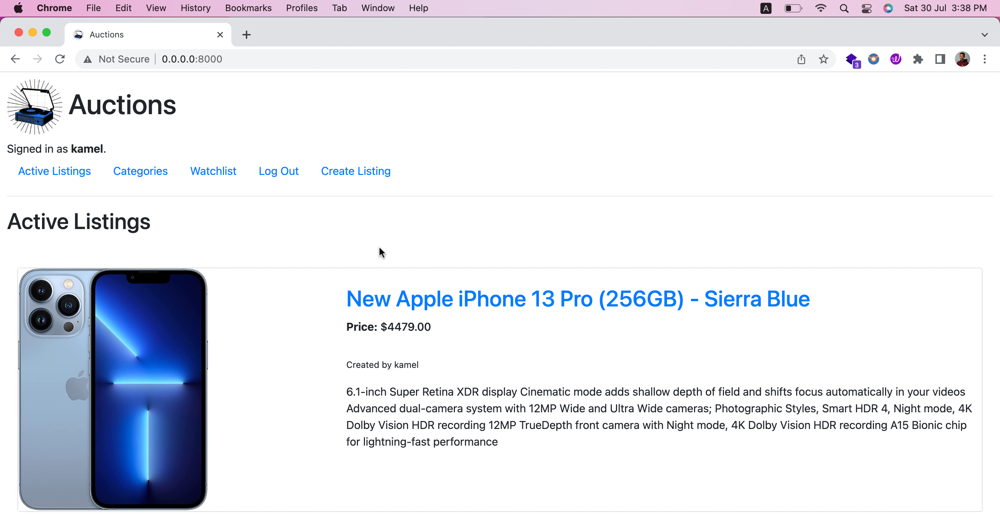

<h1 align="center">Welcome to Commerce Auction 👋</h1>
<p>
  
  <a href="#" target="_blank">
    
  </a>
  <a href="https://twitter.com/kamel402" target="_blank">
    
  </a>
</p>

> An eBay-like e-commerce auction site that will allow users to post auction listings, place bids on listings, comment on those listings, and add listings to a “watchlist.”



----
### ✨ [Demo](https://youtu.be/toINoGzY46w)

## Prerequisites

Commerce auctions app uses **PostgreSQL** as Database, and **Redis DB** for caching, and the rest of prerequisites was defined in the requirements.txt file.

## 📖 Installation

Commerce auctions app can be installed via Docker. To start, clone the repo to your local computer and change into the proper directory, then run docker compose.

```
$ git clone https://github.com/kamel402/commerce.git
$ cd commerce
$ docker compose up
```


## Author

👤 **Kamel**

* Twitter: [@kamel402](https://twitter.com/kamel402)
* Github: [@kamel402](https://github.com/kamel402)
* LinkedIn: [@kamelgerado](https://linkedin.com/in/kamelgerado)

## License

[GNU General Public License v3.0](LICENSE)
